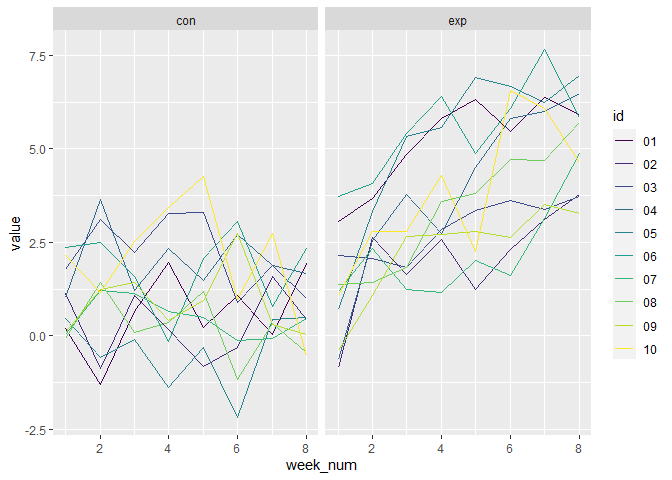

P8105 HW5
================
Lucia Wang (lw3061)

## Question 1

## Question 2: import and tidy data

First I used `list.files` to make a list of the file names. Then I
created a function that would read in a file and tidy it into the proper
format. Then I used `map` with this new function and the list of names,
and `bind_rows` to create the final dataframe.

``` r
names = list.files(path="data", full.names=TRUE)

readin_csv = function(path) {
  
  df =
    read_csv(path) |>
    janitor::clean_names() |>
    mutate(
      ident = path
    ) |>
  separate(ident, into=c("e", "arm","e2", "id", "csv"), sep=c(5,8,9,11)) |>
  arrange(arm, id) |>
  pivot_longer(week_1:week_8,
               names_to = "week",
               values_to = "value") |>
  separate(week, into=c("w", "week_no"), sep="_") |> 
  select(-e, -e2, -csv, -w)
  
}

output = map(names, readin_csv) |> bind_rows()
```

The following plot shows the results of subjects over time, comparing
the `con`trol group with the `ex`perimental group.

``` r
output |>
  mutate(week_num = as.numeric(week_no)) |>
  ggplot(aes(x=week_num, y=value, color=id)) + geom_line() + facet_grid(~arm)
```

<!-- -->
Overall, the experimental group saw large increases in their measured
values while the control group did not change much. There was a big jump
around week 1-2 for the experimental group which continued to increase
at a less steep rate to week 8. The control group seemed to fluctuate
more around the value of 0, with more inconsistencies in increasing or
decreasing behaviors.

## Question 3
