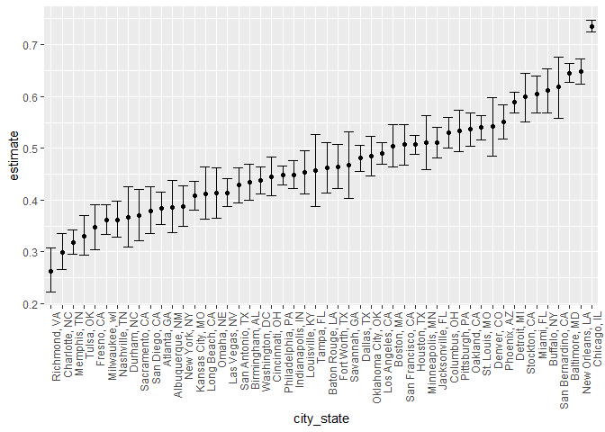
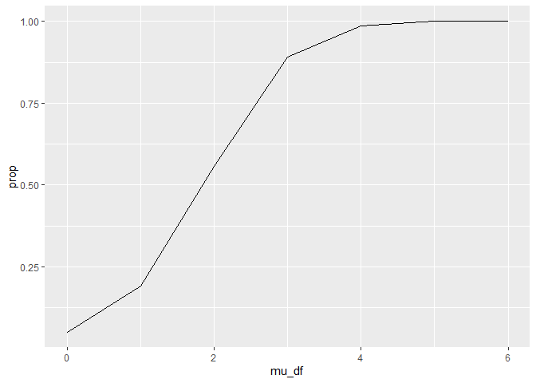

P8105 HW5
================
Lucia Wang (lw3061)

## Question 1: WP unsolved homicides data

``` r
homicide = 
  read_csv("homicide-data.csv") |> 
  janitor::clean_names() |>
  separate(reported_date, into=c("year","month","day"), sep=c(4,6)) |>
  mutate(city_state = str_c(city, ", ", state)) |>
  filter(city_state != "Tulsa, AL") 
```

The raw data has 52178 homicides between 2010 and 2016. It includes
information about the `reported_date` of murder, which I separated into
`year`,`month`, and `day`. Information about the victim’s name, age,
race, sex, and location are included, as well as the `disposition` or
status of the homicide case.

``` r
homi_status = homicide |> 
  mutate(status = case_when(
    disposition %in% c("Closed without arrest","Open/No arrest") ~ "unsolved",
    disposition == "Closed by arrest" ~ "solved"
  )) |>
  select(city_state, disposition, status) |> 
  group_by(city_state) |>
  summarize(total =n(),
            unsolved = sum(status == "unsolved")) 

homi_status  |>
  knitr::kable()
```

| city_state         | total | unsolved |
|:-------------------|------:|---------:|
| Albuquerque, NM    |   378 |      146 |
| Atlanta, GA        |   973 |      373 |
| Baltimore, MD      |  2827 |     1825 |
| Baton Rouge, LA    |   424 |      196 |
| Birmingham, AL     |   800 |      347 |
| Boston, MA         |   614 |      310 |
| Buffalo, NY        |   521 |      319 |
| Charlotte, NC      |   687 |      206 |
| Chicago, IL        |  5535 |     4073 |
| Cincinnati, OH     |   694 |      309 |
| Columbus, OH       |  1084 |      575 |
| Dallas, TX         |  1567 |      754 |
| Denver, CO         |   312 |      169 |
| Detroit, MI        |  2519 |     1482 |
| Durham, NC         |   276 |      101 |
| Fort Worth, TX     |   549 |      255 |
| Fresno, CA         |   487 |      169 |
| Houston, TX        |  2942 |     1493 |
| Indianapolis, IN   |  1322 |      594 |
| Jacksonville, FL   |  1168 |      597 |
| Kansas City, MO    |  1190 |      486 |
| Las Vegas, NV      |  1381 |      572 |
| Long Beach, CA     |   378 |      156 |
| Los Angeles, CA    |  2257 |     1106 |
| Louisville, KY     |   576 |      261 |
| Memphis, TN        |  1514 |      483 |
| Miami, FL          |   744 |      450 |
| Milwaukee, wI      |  1115 |      403 |
| Minneapolis, MN    |   366 |      187 |
| Nashville, TN      |   767 |      278 |
| New Orleans, LA    |  1434 |      930 |
| New York, NY       |   627 |      243 |
| Oakland, CA        |   947 |      508 |
| Oklahoma City, OK  |   672 |      326 |
| Omaha, NE          |   409 |      169 |
| Philadelphia, PA   |  3037 |     1360 |
| Phoenix, AZ        |   914 |      504 |
| Pittsburgh, PA     |   631 |      337 |
| Richmond, VA       |   429 |      113 |
| Sacramento, CA     |   376 |      139 |
| San Antonio, TX    |   833 |      357 |
| San Bernardino, CA |   275 |      170 |
| San Diego, CA      |   461 |      175 |
| San Francisco, CA  |   663 |      336 |
| Savannah, GA       |   246 |      115 |
| St. Louis, MO      |  1677 |      905 |
| Stockton, CA       |   444 |      266 |
| Tampa, FL          |   208 |       95 |
| Tulsa, OK          |   583 |      193 |
| Washington, DC     |  1345 |      589 |

The above table shows the number of unsolved cases and the total number
of homicides per city.

``` r
balt_md = 
  prop.test(
    x = filter(homi_status, city_state=="Baltimore, MD") |> pull(unsolved),
    n = filter(homi_status, city_state=="Baltimore, MD") |> pull(total)
  )|>
  broom::tidy() |>
  janitor::clean_names()

balt_md |> select(estimate,conf_low, conf_high) |> knitr::kable()
```

|  estimate |  conf_low | conf_high |
|----------:|----------:|----------:|
| 0.6455607 | 0.6275625 | 0.6631599 |

The estimated proportion and 95% confidence interval for unsolved
homicides in Baltimore, MD are in the table above.

``` r
all_cities =
  homi_status |>
  mutate(
    prop = map2(unsolved, total, \(x,n) prop.test(x=x,n=n)),
    tidied = map(prop, broom::tidy)
  ) |>
  select(-prop) |>
  unnest(tidied) |>
  janitor::clean_names() |>
  select(city_state, estimate, conf_low, conf_high) |>
  mutate(
    city_state = fct_reorder(city_state, estimate)
  )
```

The above code runs `prop.test` on all 50 cities.

``` r
all_cities |>
  ggplot(aes(x=city_state, y=estimate)) +
  geom_point() +
  geom_errorbar(aes(ymin=conf_low, ymax=conf_high)) +
   theme(axis.text.x = element_text(angle = 90, hjust = 1))
```

<!-- -->

The range of proportions of homicides unsolved goes from around 0.27 to
0.74.

## Question 2: iterate the importing and tidying of data

First I used `list.files` to make a list of the file names. Then I
created a function that would read in a file and tidy it into the proper
format. Then I used `map` with this new function and the list of names,
and `bind_rows` to create the final dataframe.

``` r
names = list.files(path="data", full.names=TRUE)

readin_csv = function(path) {
  
  df =
    read_csv(path) |>
    janitor::clean_names() |>
    mutate(
      ident = path
    ) |>
  separate(ident, into=c("e", "arm","e2", "id", "csv"), sep=c(5,8,9,11)) |>
  arrange(arm, id) |>
  pivot_longer(week_1:week_8,
               names_to = "week",
               values_to = "value") |>
  separate(week, into=c("w", "week_no"), sep="_") |> 
  select(-e, -e2, -csv, -w)
  
}

output = map(names, readin_csv) |> bind_rows()
```

The following plot shows the results of subjects over time, comparing
the `con`trol group with the `ex`perimental group.

``` r
output |>
  mutate(week_num = as.numeric(week_no)) |>
  ggplot(aes(x=week_num, y=value, color=id)) + geom_line() + facet_grid(~arm)
```

<!-- -->

Overall, the experimental group saw large increases in their measured
values while the control group did not change much. There was a big jump
around week 1-2 for the experimental group which continued to increase
at a less steep rate to week 8. The control group seemed to fluctuate
more around the value of 0, with more inconsistencies in increasing or
decreasing behaviors.

## Question 3: simulate power in one-sample t-test

First, a function to calculate the mu_hat and p-value using the t-test
was created. Then a new dataframe using `map` was used to simulate this
function 5000 times.

``` r
sim_mean_ttest = function(mu) {
  data = tibble(
    x = rnorm(n=30, mean=mu, sd=5)
  )
  
  output = data |> 
    t.test() |> 
    broom::tidy() |>
    select(estimate, p.value) |>
    rename(mu_hat=estimate, pval=p.value)
}

sim_results = expand_grid(
  mu_df = c(0,1,2,3,4,5,6),
  iter = 1:5000
) |>
  mutate(
    estimate = map(mu_df, sim_mean_ttest)
  ) |>
  unnest(estimate)
```

Next are plots of the simulated data.

``` r
sim_results |>
  group_by(mu_df) |>
  summarize(
    rej = sum(pval < 0.05),
    prop = rej/5000
  ) |>
  ggplot(aes(x=mu_df, y=prop)) + geom_line()
```

<!-- -->

As effect size increases, power also increases (the proportion of
estimates where the null was rejected increases). This is because the
difference needed for statistical significance is bigger so it becomes
more likely that you will reject the null.

``` r
true_df = sim_results |>
  group_by(mu_df) |>
  summarize(
    mean_mu = mean(mu_hat)
  )

rej_df = sim_results |>
  filter(pval < 0.05) |>
  group_by(mu_df) |>
  summarize(
    mean_mu = mean(mu_hat)
  )

ggplot(true_df, aes(x=mu_df, y=mean_mu)) + 
  geom_line() +
  geom_line(data=rej_df, color="red")
```

<!-- -->

In this plot, the red line shows the association between true mu and
average estimate of mu-hat for only those samples where the null was
rejected, while the black line contains all samples. The sample average
of mu-hat for only the null-rejected data does not approximate the true
value of mu when the effect size is smaller, around 0-3. Around 3-4, the
red line starts to approach the black line and does approximate the true
value of mu as effect size increases.
